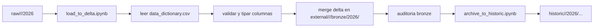

# Naturapet_DLH

Repositorio base del proyecto `Naturapet_DLH` para Azure Databricks, ADLS Gen2 y GitHub Actions usando Databricks Asset Bundles.

## Configuracion inicial aplicada

- Workspace Databricks: `https://adb-7405606739630987.7.azuredatabricks.net`
- Storage account: `demodldb`
- Contenedor: `democodex`
- Catalogos por ambiente: `naturapet_dev`, `naturapet_qa`, `naturapet_prod`
- Dominios de datos: `comercial`, `finanzas`, `gobierno`, `operaciones`, `shared`
- Schemas por dominio: `*_bronze`, `*_silver`, `*_gold`

## Estructura de almacenamiento

Rutas base configuradas en formato `abfss://`:

- `external`: `abfss://democodex@demodldb.dfs.core.windows.net/external/<ambiente>/<dominio>/<capa>/2026/<mes>`
- `raw`: `abfss://democodex@demodldb.dfs.core.windows.net/raw/<ambiente>/<dominio>/2026/<mes>`
- `historic`: `abfss://democodex@demodldb.dfs.core.windows.net/historic/<dominio>/2026/<mes>`

## Estructura del repositorio

```text
.
|-- .github/
|   `-- workflows/
|       `-- databricks-cicd.yml
|-- conf/
|   |-- environments/
|   |   |-- dev.yml
|   |   |-- qa.yml
|   |   `-- prod.yml
|   `-- jobs/
|       `-- monthly_file_refresh.yml
|-- resources/
|   `-- jobs/
|       `-- monthly_file_refresh.job.yml
|-- notebooks/
|   |-- comercial/
|   |   |-- bronze/
|   |   |-- silver/
|   |   `-- gold/
|   |-- finanzas/
|   |   |-- bronze/
|   |   |-- silver/
|   |   `-- gold/
|   |-- gobierno/
|   |   |-- bronze/
|   |   |-- silver/
|   |   `-- gold/
|   |-- operaciones/
|   |   |-- bronze/
|   |   |-- silver/
|   |   `-- gold/
|   `-- shared/
|       |-- bronze/
|       |-- silver/
|       `-- gold/
|-- src/
|   `-- common/
|       |-- config.py
|       |-- delta_load.py
|       |-- io.py
|       |-- notebook_entry.py
|       |-- notebook_runner.py
|       |-- schema.py
|       `-- validation.py
|-- tests/
|   `-- test_project_structure.py
`-- databricks.yml
```

## CI/CD esperado

- Push a `develop`: valida y despliega a `dev`
- Push a `qa`: valida y despliega a `qa`
- Pull request hacia `main`: valida el bundle y los tests
- Push a `main` despues de aprobar y hacer merge del PR: valida y despliega a `prod`

En Databricks Asset Bundles, el target `dev` usa `mode: development` y por eso publica en un `root_path` de usuario: `~/.bundle/Naturapet_DLH/dev`. Los targets `qa` y `prod` siguen usando `/Workspace/Shared/Naturapet_DLH/<target>`.

La aprobacion humana para produccion queda soportada por la regla del pull request y por las protecciones del environment `prod` en GitHub.

## Secrets requeridos en GitHub Environments

- `DATABRICKS_HOST`
- `DATABRICKS_CLIENT_ID`

## Comandos utiles

```powershell
databricks bundle validate --target dev
databricks bundle deploy --target dev
databricks bundle validate --target qa
databricks bundle deploy --target qa
databricks bundle validate --target prod
databricks bundle deploy --target prod
```

## Carga bronze implementada

Cada dominio tiene dos notebooks Databricks `.ipynb` en `notebooks/<dominio>/bronze/`:

- `load_to_delta.ipynb`: lee archivos desde `raw/<ambiente>/<dominio>/2026`, valida columnas contra `gobierno/2026/data_dictionary.csv`, hace `merge` incremental para archivos mensuales y upsert completo para archivos ubicados directamente en `2026`.
- `archive_to_historic.ipynb`: mueve a `historic/<dominio>/2026/...` solo los archivos con carga exitosa registrada en la auditoria bronze.

La logica reutilizable vive en `src/common/`:

- `config.py`: arma rutas `raw`, `external` e `historic` a partir de `abfss://democodex@demodldb.dfs.core.windows.net` y del ambiente.
- `io.py`: descubre archivos por area, detecta el tipo de archivo y mueve archivos a `historic`.
- `schema.py`: normaliza nombre de tabla, valida columnas y conforma tipos/campos usando `data_dictionary.csv`.
- `delta_load.py`: crea o actualiza tablas Delta y mantiene auditoria de cargues.
- `validation.py`: aplica validaciones tecnicas como archivo no vacio y coherencia entre `mes_carga` y el folder mensual.
- `notebook_runner.py`: punto de entrada compartido para los notebooks `.ipynb`.

### Flujo general de bronze

Los notebooks de `bronze` funcionan igual en todas las areas. Lo que cambia es el dominio que procesan; la logica comun arma las rutas por ambiente, descubre archivos en `raw`, valida la estructura con `data_dictionary.csv`, hace `merge` a Delta y luego archiva los archivos exitosos.



### Convenciones de carga

- Catalogos por ambiente: `naturapet_dev`, `naturapet_qa`, `naturapet_prod`.
- Schemas bronze por area: `comercial_bronze`, `finanzas_bronze`, `gobierno_bronze`, `operaciones_bronze`, `shared_bronze`.
- Ruta raw por area: `abfss://democodex@demodldb.dfs.core.windows.net/raw/<ambiente>/<area>/2026/...`.
- Ruta external por tabla Delta: `abfss://democodex@demodldb.dfs.core.windows.net/external/<ambiente>/<area>/bronze/2026/<tabla>`.
- Ruta historic por archivo procesado: `abfss://democodex@demodldb.dfs.core.windows.net/historic/<area>/2026/...`.
- Deteccion de formato: el flujo soporta `csv`, `json` y `parquet`; para este dataset Naturapet los archivos esperados son `csv`.
- Las columnas de negocio se ordenan y tipan según `data_dictionary.csv`; luego se agregan columnas técnicas `_np_*`.
- Si una tabla no tiene PK declarada en `data_dictionary.csv`, el merge usa `_np_record_hash`.
- El job `monthly_file_refresh` esta definido para ejecutar notebooks sobre serverless jobs compute, por lo que no crea clusters dedicados en cada corrida.

### Requisito de ejecucion en Databricks

Estos notebooks usan Python, Spark y `dbutils`, por lo que no deben ejecutarse sobre un SQL warehouse tradicional. Si el workspace no tiene serverless jobs compute habilitado, la alternativa correcta es configurar un `existing_cluster_id` con permisos de uso para la identidad que ejecuta el job.

## Trabajo con ramas

- `develop` es la rama operativa para cambios que deben desplegar a `dev`.
- `qa` se usa para promocionar cambios al ambiente `qa`.
- `main` se usa para promocionar cambios al ambiente `prod`.

Si quieres revisar algo manualmente antes de empujar, puedes crear una rama local temporal desde `develop`, validar el diff y luego integrar esos cambios de vuelta a `develop`. En este trabajo los cambios finales quedaron integrados y publicados directamente en `develop`.
