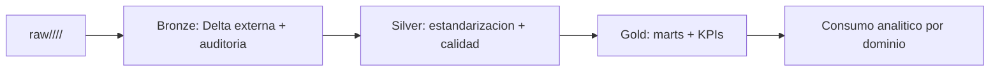

# Naturapet_DLH

Repositorio del Data Lakehouse de Naturapet sobre Azure Databricks, ADLS Gen2, Unity Catalog y Databricks Asset Bundles. El proyecto implementa un flujo mensual por dominios de datos con capas Bronze, Silver y Gold, mas un job orquestador de Data Mesh para encadenar el refresco completo.

## Alcance actual

- Workspace Databricks: `https://adb-7405606739630987.7.azuredatabricks.net`
- Bundle: `Naturapet_DLH`
- Ruta de despliegue por target: `/Workspace/Naturapet_BI/<target>`
- Storage account: `demodldb`
- Contenedor: `democodex`
- Catalogos por ambiente: `naturapet_dev`, `naturapet_qa`, `naturapet_prod`
- Dominios: `shared`, `comercial`, `finanzas`, `operaciones`, `gobierno`
- Capas publicadas por dominio: `bronze`, `silver`, `gold`
- Schemas esperados: `<dominio>_bronze`, `<dominio>_silver`, `<dominio>_gold`

## Arquitectura Data Mesh

El proyecto esta organizado como un Data Mesh por dominios. Cada dominio conserva responsabilidad sobre sus entidades y transformaciones, mientras `shared` concentra dimensiones y logica comun reutilizable. Las capas siguen este contrato:

- Bronze: aterrizaje tecnico desde `raw`, validacion contra diccionario, carga Delta externa y auditoria de archivos.
- Silver: estandarizacion de esquema, correccion de nulos, normalizacion de dominios, derivaciones de negocio y controles de calidad.
- Gold: marts de negocio, objetivos, metricas ejecutivas y validaciones finales para consumo analitico.

El job `monthly_data_mesh_refresh` representa la orquestacion unificada del mesh: ejecuta primero Bronze completo, luego Silver completo y finalmente Gold completo. Esto permite correr el flujo end-to-end sin duplicar la definicion interna de cada capa.



## Operacion de jobs

Los jobs estan definidos en `resources/jobs/` y se despliegan con Databricks Asset Bundles. Todos tienen `max_concurrent_runs: 1` y cola habilitada para evitar corridas simultaneas sobre la misma ventana mensual.

| Job | Horario | Tipo de carga | Proposito |
| --- | --- | --- | --- |
| `monthly_file_refresh` | Dia 1 de cada mes, 06:00 `America/Bogota` | Incremental por archivos mensuales y archivado de exitosos | Carga Bronze para `shared`, `comercial`, `finanzas`, `operaciones` y `gobierno`. |
| `monthly_silver_refresh` | Dia 1 de cada mes, 06:30 `America/Bogota` | Incremental por tablas con auditoria Silver | Ejecuta cinco pasos por dominio: esquema, nulos, normalizacion, derivaciones y calidad. |
| `monthly_gold_refresh` | Dia 1 de cada mes, 07:00 `America/Bogota` | Refresco de marts Gold por dominio | Genera marts comerciales, operacionales, financieros, objetivos y KPIs ejecutivos. |
| `monthly_data_mesh_refresh` | Sin schedule propio en el bundle | Orquestacion end-to-end por subjobs | Llama Bronze, luego Silver, luego Gold usando `run_job_task`. |

Expresiones cron Quartz configuradas:

```text
monthly_file_refresh   0 0 6 1 * ?
monthly_silver_refresh 0 30 6 1 * ?
monthly_gold_refresh   0 0 7 1 * ?
```

El orquestador `monthly_data_mesh_refresh` corre con el service principal configurado en `github_actions_service_principal_name` y tiene permiso `CAN_MANAGE` sobre el job. Al no tener `schedule`, se deja listo para ejecucion bajo demanda o para ser invocado por automatizaciones externas.

## Flujo de datos

### Bronze

Cada dominio tiene notebooks en `notebooks/<dominio>/bronze/`:

- `load_to_delta.ipynb`: lee archivos desde `raw/<ambiente>/<dominio>/<anio>`, valida columnas contra el diccionario de datos, aplica tipos, agrega columnas tecnicas `_np_*` y hace merge/upsert hacia tablas Delta externas.
- `archive_to_historic.ipynb`: mueve a `historic/<dominio>/<anio>/...` los archivos con carga exitosa registrada en la auditoria Bronze.

La logica comun vive en `src/common/`:

- `config.py`: arma rutas `raw`, `external` e `historic`.
- `io.py`: descubre archivos, identifica formato y mueve archivos a historico.
- `schema.py`: normaliza nombres, valida columnas y aplica tipos.
- `delta_load.py`: crea o actualiza tablas Delta y mantiene auditoria de carga.
- `validation.py`: aplica validaciones tecnicas.
- `notebook_runner.py`: punto de entrada compartido para notebooks Bronze.

### Silver

Silver reutiliza notebooks compartidos para los pasos transversales y notebooks especificos cuando la derivacion depende del dominio:

- `01_schema_standardization.ipynb`
- `02_null_corrections.ipynb`
- `03_domain_normalization.ipynb`
- `04_business_derivations.ipynb`
- `05_quality_checks.ipynb`

La utilidad `src/common/silver_incremental.py` centraliza auditoria, watermarks, seleccion de tablas y merges incrementales. Cada dominio escribe en `external/<ambiente>/<dominio>/silver/<anio>`.

### Gold

Gold crea productos analiticos listos para consumo:

- `notebooks/comercial/gold/01_comercial_marts.ipynb`: ventas, ventas por producto, devoluciones y marketing mensual.
- `notebooks/operaciones/gold/02_operaciones_marts.ipynb`: inventario y logistica mensual.
- `notebooks/finanzas/gold/03_finanzas_objetivos.ipynb`: finanzas y objetivos mensuales.
- `notebooks/shared/gold/04_kpis_ejecutivos.ipynb`: KPIs ejecutivos consolidados.
- `notebooks/gobierno/gold/05_quality_checks.ipynb`: controles finales de calidad Gold.

## Estructura principal

```text
.
|-- .github/workflows/databricks-cicd.yml
|-- conf/
|   |-- environments/
|   `-- jobs/
|-- databricks.yml
|-- notebooks/
|   |-- comercial/
|   |-- finanzas/
|   |-- gobierno/
|   |-- operaciones/
|   `-- shared/
|-- resources/jobs/
|   |-- monthly_data_mesh_refresh.job.yml
|   |-- monthly_file_refresh.job.yml
|   |-- monthly_gold_refresh.job.yml
|   `-- monthly_silver_refresh.job.yml
|-- src/
|   |-- common/
|   `-- utilities/
`-- tests/
```

## Rutas de almacenamiento

Las rutas base se resuelven desde variables del bundle:

- `external`: `abfss://democodex@demodldb.dfs.core.windows.net/external/<ambiente>/<dominio>/<capa>/<anio>/<mes>`
- `raw`: `abfss://democodex@demodldb.dfs.core.windows.net/raw/<ambiente>/<dominio>/<anio>/<mes>`
- `historic`: `abfss://democodex@demodldb.dfs.core.windows.net/historic/<dominio>/<anio>/<mes>`

## CI/CD

El workflow `.github/workflows/databricks-cicd.yml` resuelve el target a partir de la rama:

- Push a `develop`: valida tests, valida bundle y despliega a `dev`.
- Push a `qa`: valida tests, valida bundle y despliega a `qa`.
- Pull request hacia `main`: valida tests y bundle sin desplegar.
- Push a `main`: valida y despliega a `prod` usando el environment de GitHub correspondiente.

Secrets requeridos por environment:

- `DATABRICKS_HOST`
- `DATABRICKS_CLIENT_ID`

## Comandos utiles

En local, usar siempre el perfil `CREA_DEV`:

```powershell
databricks bundle validate --target dev --profile CREA_DEV
databricks bundle summary --target dev --profile CREA_DEV
databricks bundle plan --target dev --profile CREA_DEV
```

Los despliegues y ejecuciones de jobs deben hacerse solo con aprobacion humana:

```powershell
databricks bundle deploy --target dev --profile CREA_DEV
databricks bundle run monthly_data_mesh_refresh --target dev --profile CREA_DEV
```

## Trabajo con ramas

- `develop` es la rama operativa para cambios que despliegan a `dev`.
- `qa` se usa para promocionar cambios al ambiente `qa`.
- `main` se usa para promocionar cambios al ambiente `prod`.

Para cambios de produccion, preparar primero el plan y comandos sugeridos; no desplegar a `prod` sin aprobacion explicita.
